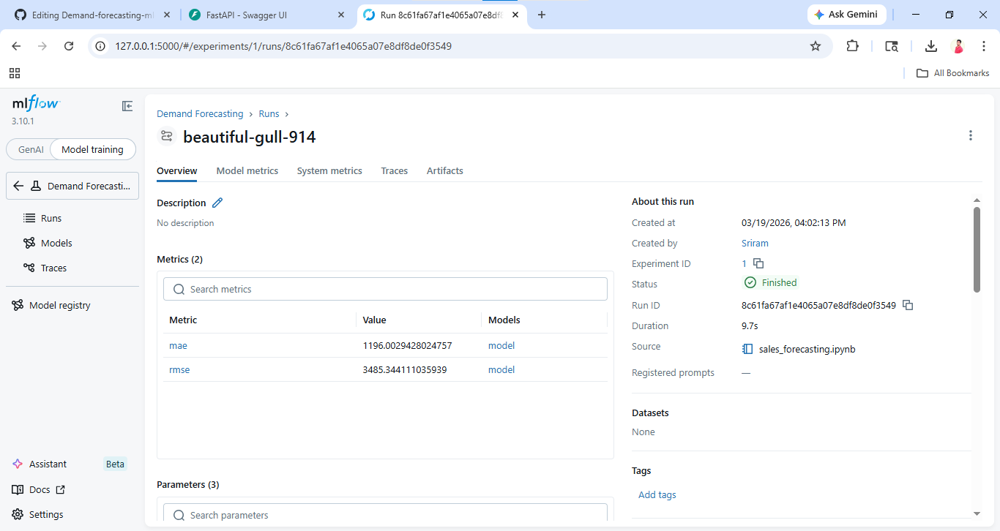
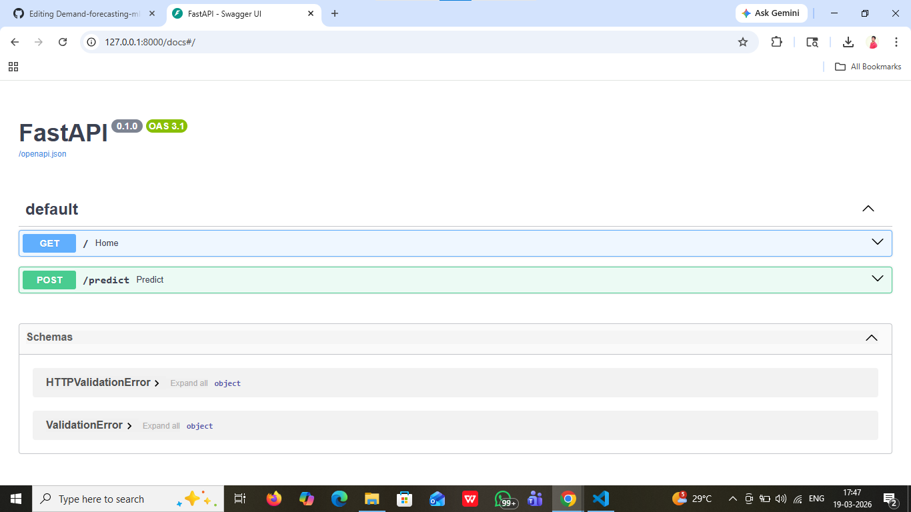
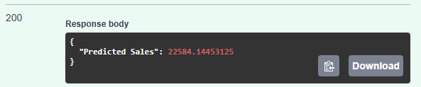

Demand Forecasting System (ML + MLOps + API)

End-to-end machine learning system for predicting retail demand using XGBoost, MLflow, and FastAPI, with real-time prediction capabilities.

📌 Overview

This project simulates a real-world retail demand forecasting system used in supply chain optimization. It predicts weekly product sales using historical data, seasonality, and business signals.

🎯 Key Features

📊 Time-series feature engineering (lag features, rolling mean)

🤖 Machine Learning model using XGBoost

📈 Experiment tracking with MLflow

🌐 REST API deployment using FastAPI

⚡ Real-time prediction via API

🛠️ Tech Stack

1.Python, Pandas, NumPy

2.Scikit-learn, XGBoost

3.MLflow (MLOps)

4.FastAPI (Deployment)

5.Matplotlib, Seaborn

📊 Model Performance

1.MAE: ~1196

2.RMSE: ~3485

Model successfully captures seasonality and holiday demand spikes.

🔄 Workflow

1.Data Cleaning & Preprocessing

2.Exploratory Data Analysis (EDA)

3.Feature Engineering (lag, rolling features)

4.Model Training (XGBoost)

5.Evaluation

6.MLflow Tracking

7.API Deployment

## 📸 Project Screenshots

### MLflow Tracking

### FastAPI Endpoint

### Prediction Output

🌐 API Usage

Run API:

uvicorn app:app --reload

Open docs:

http://127.0.0.1:8000/docs

📈 Business Impact

Improves demand forecasting accuracy

Helps reduce overstock & stockouts

Enables data-driven decision making

👨‍💻 Author

Jeevanandham KP

LinkedIn: https://linkedin.com/in/jeevanandham-kp-a93a51187

GitHub: https://github.com/jeevakpq
